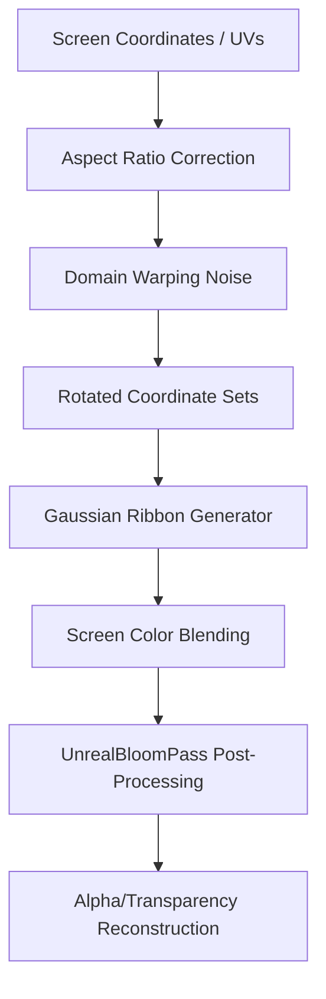

# Neo Fluid Movement Guide

This guide details the mathematical foundations, coordinate mapping systems, and GLSL shader techniques used to create the signature organic fluid flow, color ribbons, and glow effects of the **Neo** brand. It is designed to help you replicate this fluid motion as a high-performance, full-page webpage background or container texture.

---

## 1. Core Visual Principles

The effect mimics slow-moving, high-viscosity glowing fluid ribbons. It is composed of three visual layers:
1. **The Deep Base**: A dark, saturated indigo core with subtle lighting gradients.
2. **The Flow Ribbons**: 7 overlapping animated color trails (electric blue, cyan, teal, green, purple) that swirl and blend organically.
3. **The Soft Glow**: A screen-space glow layer that blurs the colors together into a vibrant, premium gradient.



---

## 2. Preventing Coordinate Stretching

When applying a shader across a full-screen window (e.g., 16:9 or ultra-wide aspect ratios), standard texture UV coordinates `[0.0, 1.0]` will stretch the visual pattern horizontally.

To keep the fluid flows perfectly circular and organic, you must scale the coordinates by the viewport's aspect ratio.

### GLSL Coordinate Correction
```glsl
uniform vec2 uResolution;
varying vec2 vUv;

void main() {
  // Translate [0,1] UV space to [-1,1] center-aligned space
  vec2 uv = vUv * 2.0 - 1.0;
  
  // Multiply X axis by aspect ratio (Width / Height)
  float aspect = uResolution.x / uResolution.y;
  vec2 correctedUv = vec2(uv.x * aspect, uv.y);
  
  // Multiply by scale factor to control ribbon density/zoom
  vec2 coord = correctedUv * 2.0;
}
```

---

## 3. Mathematical Foundations of the Fluid Flow

### A. Domain Warping (Coordinate Perturbation)
Rather than animating the ribbons directly, we warp the 2D coordinate space before drawing them. We add time-dependent sine and cosine waves to the coordinates, causing the ribbons to curve and fold like marbled paint:

```glsl
// Normalized cycle phase (0.0 to 2*PI)
float cyc = uLoopPhase * 6.28318530718;

vec2 warpedCoord = coord;
warpedCoord.x += sin(coord.y * 2.2 + cyc * 1.0 + uSeed) * 0.08;
warpedCoord.y += cos(coord.x * 1.8 - cyc * 2.0 + uSeed) * 0.07;
```

### B. Gaussian-Blurred Ribbons
To make the ribbons completely soft, fuzzy, and free of hard edges, each ribbon is calculated using a **Gaussian distribution** rather than standard linear steps or `smoothstep` boundaries.

$$f(d) = e^{-\frac{d^2}{2\sigma^2}}$$

Where:
* $d$ is the distance from the point to the ribbon's curved trajectory.
* $\sigma$ (sigma) is the blur radius, which determines the softness.

```glsl
float softBand(
  vec2 p,
  float phase,
  float speed,
  float bend,
  float centerOffset,
  float edgeWidth,
  float centerWidth,
  float falloff
) {
  float time = uLoopPhase * 6.28318530718 * speed + phase + uSeed * 0.19;
  float x = p.x;
  
  // Calculate curved trajectory path
  float curve = sin(x * 2.35 + time) * bend;
  curve += sin(x * 4.2 - time * 0.72 + phase) * bend * 0.38;
  curve += cos(x * 1.35 + time * 0.5) * bend * 0.22;

  // Calculate dynamic width across the screen width (fades out at ends)
  float local = clamp(1.0 - abs(x - centerOffset) * falloff, 0.0, 1.0);
  local = smoothstep(0.0, 1.0, local);
  float dynamicWidth = mix(edgeWidth, centerWidth, local);
  
  float d = abs(p.y - curve);
  
  // Gaussian blur profile (broad sigma prevents hard cores)
  float sigma = dynamicWidth * 1.8;
  return exp(-(d * d) / (2.0 * sigma * sigma));
}
```

### C. Rotation Matrices
Each of the 7 ribbons is rotated by a different angle to make their paths cross and blend. This is achieved using a 2D rotation matrix:

```glsl
mat2 rot2(float a) {
  float c = cos(a);
  float s = sin(a);
  return mat2(c, -s, s, c);
}

// Example: Layering two different ribbons
float blueBand = softBand(rot2(cyc * 1.0) * mat2(0.94, -0.34, 0.34, 0.94) * warpedCoord, 0.4, 1.0, 0.27, -0.02, 0.32, 0.36, 1.12);
float greenBand = softBand(rot2(cyc * 2.5) * mat2(0.71, -0.71, 0.71, 0.71) * warpedCoord, 1.5, 2.0, 0.35, 0.0, 0.3, 0.5, 1.2);
```

---

## 4. Color Compositing

Ribbon intensity masks are accumulated and blended with their brand colors. To prevent blowout in a full-screen environment, the ribbon overlay contribution is scaled down so that color channels do not oversaturate to solid white.

```glsl
float bandMask = clamp(blueBandA + cyanBandA + tealBand + blueBandB + cyanBandB + greenBand + purpleBand, 0.0, 2.75);
vec3 bandColor = blueBandA * electricBlue * 1.28 +
                 cyanBandA * cyanBlue * 1.08 +
                 tealBand * vec3(0.0, 0.0, 1.0) * 1.6 +
                 greenBand * vec3(0.0, 0.67, 0.5) * 1.4;
                 
// Normalize to prevent color blowout where ribbons overlap
bandColor /= max(blueBandA + cyanBandA + tealBand + ... , 0.001);

// Ambient base mixing (using uIntensityScale = 0.45 for full-screen backgrounds)
vec3 color = mix(deepCore, electricBlue, 0.35);
color = saturateColor(color, 2.35);

float intensityScale = 0.45;
color = mix(color, bandColor, bandMask * intensityScale * 0.8);
color += bandColor * bandMask * intensityScale * 1.15;

// Color saturation compression & gamma correction
color = clamp(saturateColor(color, 2.2) * 1.15, 0.0, 4.0);
color = pow(max(color, vec3(0.0)), vec3(0.82));
```

---

## 5. Replicating the Post-Processing Bloom

The signature neon look relies heavily on **UnrealBloomPass**. In Three.js, you wrap the renderer in an `EffectComposer`.

### Background Bloom Configuration
To prevent full-screen canvas blowout and keep page text readable, use a gentler bloom configuration:
* **Strength**: `0.42` (instead of 0.7 used on buttons)
* **Radius**: `1.1` (produces smooth blending)
* **Threshold**: `0.28` (prevents darker base colors from blooming unnecessarily)

### Transparent Compositing Pipeline
A major hurdle with bloom passes is that they overwrite the canvas alpha channel, rendering the background solid black. To maintain transparency (e.g., to see page content underneath), place an **Alpha Reconstruction Shader** at the end of the composer:

```javascript
import { EffectComposer } from 'three/addons/postprocessing/EffectComposer.js';
import { RenderPass } from 'three/addons/postprocessing/RenderPass.js';
import { UnrealBloomPass } from 'three/addons/postprocessing/UnrealBloomPass.js';
import { ShaderPass } from 'three/addons/postprocessing/ShaderPass.js';
import { OutputPass } from 'three/addons/postprocessing/OutputPass.js';

// Setup Composer
const composer = new EffectComposer(renderer);
composer.addPass(new RenderPass(scene, camera));

// Unreal Bloom setup (strength, radius, threshold)
const bloomPass = new UnrealBloomPass(new THREE.Vector2(window.innerWidth, window.innerHeight), 0.42, 1.1, 0.28);
composer.addPass(bloomPass);
composer.addPass(new OutputPass());

// Custom ShaderPass to restore transparency based on color brightness
const alphaCorrectionPass = new ShaderPass({
  uniforms: { tDiffuse: { value: null } },
  vertexShader: `
    varying vec2 vUv;
    void main() {
      vUv = uv;
      gl_Position = projectionMatrix * modelViewMatrix * vec4(position, 1.0);
    }
  `,
  fragmentShader: `
    uniform sampler2D tDiffuse;
    varying vec2 vUv;
    void main() {
      vec4 texel = texture2D(tDiffuse, vUv);
      
      // Calculate alpha based on the brightest color channel
      float alpha = clamp(max(max(texel.r, texel.g), texel.b), 0.0, 1.0);
      
      // Divide RGB by alpha to un-premultiply (prevents dark borders)
      vec3 color = texel.rgb;
      if (alpha > 0.001) {
        color /= alpha;
      }
      
      gl_FragColor = vec4(color, alpha);
    }
  `
});
composer.addPass(alphaCorrectionPass);
```

---

## 6. Complete Single-File Implementation (`background.html`)

Save the code below as an HTML file and open it in a browser to see the exact organic background running in real time. It is optimized for full-screen performance.

```html
<!DOCTYPE html>
<html lang="en">
<head>
  <meta charset="UTF-8">
  <meta name="viewport" content="width=device-width, initial-scale=1.0">
  <title>Neo Fluid Background</title>
  <style>
    body {
      margin: 0;
      padding: 0;
      overflow: hidden;
      background: #000214;
      font-family: 'Inter', sans-serif;
      color: #ffffff;
    }
    #bg-canvas {
      position: fixed;
      top: 0;
      left: 0;
      width: 100vw;
      height: 100vh;
      z-index: -1;
      pointer-events: none;
    }
    .content {
      position: relative;
      z-index: 1;
      display: flex;
      flex-direction: column;
      align-items: center;
      justify-content: center;
      height: 100vh;
      text-align: center;
      text-shadow: 0 2px 10px rgba(0,0,0,0.5);
    }
    h1 {
      font-size: 3rem;
      margin-bottom: 0.5rem;
      font-weight: 800;
      letter-spacing: -0.05em;
    }
    p {
      font-size: 1.2rem;
      color: rgba(255,255,255,0.7);
    }
  </style>
  <script type="importmap">
    {
      "imports": {
        "three": "https://unpkg.com/three@0.160.0/build/three.module.js",
        "three/addons/": "https://unpkg.com/three@0.160.0/examples/jsm/"
      }
    }
  </script>
</head>
<body>
  <canvas id="bg-canvas"></canvas>

  <div class="content">
    <h1>Neo Fluid Background</h1>
    <p>Replicating organic movement using custom fragment shaders</p>
  </div>

  <script type="module">
    import * as THREE from 'three';
    import { EffectComposer } from 'three/addons/postprocessing/EffectComposer.js';
    import { RenderPass } from 'three/addons/postprocessing/RenderPass.js';
    import { UnrealBloomPass } from 'three/addons/postprocessing/UnrealBloomPass.js';
    import { ShaderPass } from 'three/addons/postprocessing/ShaderPass.js';
    import { OutputPass } from 'three/addons/postprocessing/OutputPass.js';

    // 1. Scene setup
    const canvas = document.getElementById('bg-canvas');
    const renderer = new THREE.WebGLRenderer({ canvas, antialias: true, alpha: true });
    renderer.setPixelRatio(Math.min(window.devicePixelRatio, 2));
    renderer.setSize(window.innerWidth, window.innerHeight);

    const scene = new THREE.Scene();
    const camera = new THREE.OrthographicCamera(-1, 1, 1, -1, 0, 1);

    // 2. Uniforms
    const uniforms = {
      uTime: { value: 0 },
      uLoopPhase: { value: 0 },
      uResolution: { value: new THREE.Vector2(window.innerWidth, window.innerHeight) },
      uSeed: { value: 4.8 },
      uAlpha: { value: 1.0 }
    };

    // 3. Shaders
    const vertexShader = `
      varying vec2 vUv;
      void main() {
        vUv = uv;
        gl_Position = vec4(position, 1.0);
      }
    `;

    const fragmentShader = `
      uniform float uTime;
      uniform float uLoopPhase;
      uniform vec2 uResolution;
      uniform float uSeed;
      uniform float uAlpha;
      varying vec2 vUv;

      vec3 saturateColor(vec3 color, float amount) {
        float gray = dot(color, vec3(0.299, 0.587, 0.114));
        return mix(vec3(gray), color, amount);
      }

      mat2 rot2(float a) {
        float c = cos(a);
        float s = sin(a);
        return mat2(c, -s, s, c);
      }

      float bandWidthProfile(float x, float centerOffset, float edgeWidth, float centerWidth, float falloff) {
        float local = clamp(1.0 - abs(x - centerOffset) * falloff, 0.0, 1.0);
        local = smoothstep(0.0, 1.0, local);
        return mix(edgeWidth, centerWidth, local);
      }

      float softBand(
        vec2 p,
        float phase,
        float speed,
        float bend,
        float centerOffset,
        float edgeWidth,
        float centerWidth,
        float falloff
      ) {
        float time = uLoopPhase * 6.28318530718 * speed + phase + uSeed * 0.19;
        float x = p.x;
        float curve = sin(x * 2.35 + time) * bend;
        curve += sin(x * 4.2 - time * 0.72 + phase) * bend * 0.38;
        curve += cos(x * 1.35 + time * 0.5) * bend * 0.22;

        float dynamicWidth = bandWidthProfile(x, centerOffset, edgeWidth, centerWidth, falloff);
        float d = abs(p.y - curve);
        
        // Gaussian blur profile
        float sigma = dynamicWidth * 1.8;
        return exp(-(d * d) / (2.0 * sigma * sigma));
      }

      void main() {
        // Correct aspect ratio to prevent stretching
        vec2 uv = vUv * 2.0 - 1.0;
        float aspect = uResolution.x / uResolution.y;
        vec2 coord = vec2(uv.x * aspect, uv.y) * 2.0;

        float cyc = uLoopPhase * 6.28318530718;

        // Colors
        vec3 deepCore = vec3(0.005, 0.01, 0.08);
        vec3 electricBlue = vec3(0.0, 0.05, 1.0);
        vec3 cyanBlue = vec3(0.0, 0.9, 1.0);
        vec3 tealBlue = vec3(0.0, 0.58, 0.66);
        vec3 iceBlue = vec3(0.5, 0.95, 1.0);
        vec3 deepBlue = vec3(0.06, 0.2, 1.0);

        // Domain warping
        vec2 marbleUv = coord;
        marbleUv.x += sin(coord.y * 2.2 + cyc * 1.0 + uSeed) * 0.08;
        marbleUv.y += cos(coord.x * 1.8 - cyc * 2.0 + uSeed) * 0.07;

        // Layer 7 dynamic Gaussian ribbons
        float blueBandA = softBand(rot2(cyc * 1.0) * mat2(0.94, -0.34, 0.34, 0.94) * marbleUv, 0.4, 1.0, 0.27, -0.02, 0.32, 0.36, 1.12);
        float cyanBandA = softBand(rot2(cyc * -2.0) * mat2(0.82, -0.57, 0.57, 0.82) * marbleUv, 2.1, -2.0, 0.32, -0.03, 0.56, 0.64, 0.84);
        float tealBand = softBand(rot2(cyc * 3.0) * mat2(0.64, 0.77, -0.77, 0.64) * marbleUv, 4.2, 3.0, 0.3, 0.06, 0.48, 0.28, 1.16);
        float blueBandB = softBand(rot2(cyc * -4.0) * mat2(0.24, -0.97, 0.97, 0.24) * marbleUv, 1.15, 4.0, 0.24, 0.01, 0.28, 0.31, 1.24);
        float cyanBandB = softBand(rot2(cyc * 5.0) * mat2(0.38, 0.92, -0.92, 0.38) * marbleUv, 3.35, -5.0, 0.28, -0.05, 0.44, 0.28, 1.18);
        float greenBand = softBand(rot2(cyc * 2.5) * mat2(0.71, -0.71, 0.71, 0.71) * marbleUv, 1.5, 2.0, 0.35, 0.0, 0.3, 0.5, 1.2);
        
        vec2 purpleUv = rot2(cyc * -3.5) * mat2(0.5, 0.86, -0.86, 0.5) * marbleUv;
        purpleUv.y -= 0.65;
        float purpleBand = softBand(purpleUv, 5.0, -3.0, 0.25, 0.05, 0.4, 0.6, 1.0);

        float bandMask = clamp(blueBandA + cyanBandA + tealBand + blueBandB + cyanBandB + greenBand + purpleBand, 0.0, 2.75);
        vec3 bandColor =
          blueBandA * electricBlue * 1.28 +
          cyanBandA * cyanBlue * 1.08 +
          tealBand * vec3(0.0, 0.0, 1.0) * 1.6 +
          blueBandB * deepBlue * 1.24 +
          cyanBandB * iceBlue * 0.98 +
          greenBand * vec3(0.0, 0.674, 0.502) * 1.4 +
          purpleBand * vec3(0.549, 0.322, 1.0) * 1.4;
        bandColor /= max(blueBandA + cyanBandA + tealBand + blueBandB + cyanBandB + greenBand + purpleBand, 0.001);

        // Ambient base mixing (scaled down ribbon blending to prevent full-screen color blowout)
        vec3 color = mix(deepCore, electricBlue, 0.35);
        color = saturateColor(color, 2.35);
        
        float intensityScale = 0.45;
        color = mix(color, bandColor, bandMask * intensityScale * 0.8);
        color += bandColor * bandMask * intensityScale * 1.15;

        color = clamp(saturateColor(color, 2.2) * 1.15, 0.0, 4.0);
        color = pow(max(color, vec3(0.0)), vec3(0.82));

        gl_FragColor = vec4(color, uAlpha);
      }
    `;

    // 4. Material and mesh setup
    const geometry = new THREE.PlaneGeometry(2, 2);
    const material = new THREE.ShaderMaterial({
      vertexShader,
      fragmentShader,
      uniforms,
      depthWrite: false,
      depthTest: false
    });
    const mesh = new THREE.Mesh(geometry, material);
    scene.add(mesh);

    // 5. Post Processing setup
    const composer = new EffectComposer(renderer);
    composer.addPass(new RenderPass(scene, camera));

    // Glow config (Optimized for full-screen background)
    const bloomPass = new UnrealBloomPass(
      new THREE.Vector2(window.innerWidth, window.innerHeight),
      0.42, // bloom strength (gentle glow)
      1.1,  // bloom radius
      0.28  // bloom threshold (prevents dark core blowout)
    );
    composer.addPass(bloomPass);
    composer.addPass(new OutputPass());

    // 6. Animation loop
    const loopDuration = 20.0; // 20-second loop
    const clock = new THREE.Clock();

    function animate() {
      requestAnimationFrame(animate);

      const elapsed = clock.getElapsedTime();
      
      // Update uniforms (slow motion factor: 0.15)
      uniforms.uTime.value = elapsed * 0.15;
      uniforms.uLoopPhase.value = (uniforms.uTime.value % loopDuration) / loopDuration;

      composer.render();
    }
    
    animate();

    // 7. Resize handler
    window.addEventListener('resize', () => {
      const width = window.innerWidth;
      const height = window.innerHeight;
      
      renderer.setSize(width, height);
      composer.setSize(width, height);
      
      uniforms.uResolution.value.set(width, height);
    });
  </script>
</body>
</html>
```
